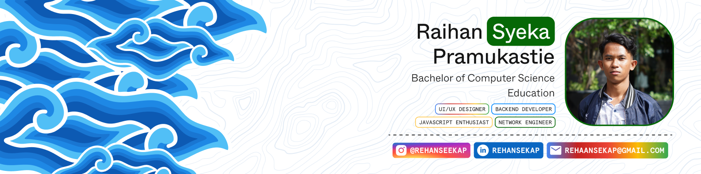

## 👋 &nbsp;Hey there! I'm Syeka

<!--  -->

<p width="100%" align="center">
  
</p>

### 💫 &nbsp;About Me:

```javascript
const syeka = {
  location: "Lembang, Bandung Barat, Jawa Barat 🇮🇩",
  role: ["UI/UX Designer", "Backend Developer"],
  currentFocus: "Learning & Building",
  interests: ["Web Development", "AI/ML", "User Experience"],
  askMeAbout: ["Web Dev", "Backend Architecture", "UI/UX Design"],
  funFact: "Currently in intensive learning mode 📚",
};
```

<!--
🌱 Following learning classes to improve my skills<br>💡 Focusing on AI/ML and Web Development<br>🎨 Combining passion in UI/UX Design with Backend Development<br>🚀 Ready to collaborate on exciting projects! -->

### 💻 &nbsp;Tech Stack:

| Category                   | Technologies                                                                                                                                                                                                                                                                                                                                                                                                                                                                                                                                                                                                                                                                                                                                                                                              |
| :------------------------- | :-------------------------------------------------------------------------------------------------------------------------------------------------------------------------------------------------------------------------------------------------------------------------------------------------------------------------------------------------------------------------------------------------------------------------------------------------------------------------------------------------------------------------------------------------------------------------------------------------------------------------------------------------------------------------------------------------------------------------------------------------------------------------------------------------------- |
| **Programming**            |        |
| **Frontend / UI**          |                                                                                                                                                                                                                       |
| **Backend / Frameworks**   |                                                                                                                                                                                                                                                                                                                                                |
| **Databases**              |                                                                                                                                                                                                                                                                                                                                                          |
| **Design & Prototyping**   |                                                                                                                                                                                                                                                                                                                                                                                                                                                                                                                                                                                 |
| **Cloud / DevOps / Tools** |                                                                                                                                                                                                                                                                                                                                                                                                                                                                        |
| **Version Control & CI**   |                                                                                                                                                                                                                                                                                                                                                                                                                                                              |

### ⚙️ &nbsp;GitHub Analytics

<p align="left">
  <a href="https://github.com/rehaansekap">
    <div align="center" style="text-decoration:none">
      
      &nbsp;
      
    </div>
    <div align="center" style="text-decoration:none">
          
    </div>
  </a>
</p>

<div align="center">
  <a href="hthtps://github.com/rehaansekap">
    
  </a>
</div>

### 🤝🏻 &nbsp;Connect with Me

<p align="center">
  <a href="https://www.linkedin.com/in/rehansekap/"></a>
  <a href="https://medium.com/@rehanseekap"></a>
  <a href="https://www.instagram.com/rehanseekap/"></a>
  <a href="mailto:rehaansekap@gmail.com"></a>
  <a href="https://www.facebook.com/rehanseekap"></a>
</p>

### 🐍 &nbsp;Snake Animation


